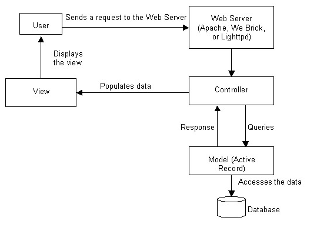

# Tony's engineering notes

## ruby on rails

summary of :: 
Developing Applications Using Ruby on Rails

- The framework uses the Model-View-Controller (MVC) pattern
	- It separates the presentation logic from the business logic of the application. 
	- if there is a model class called employee, then in the MVC architecture there should be a corresponding table named employees in the database.

picture here

